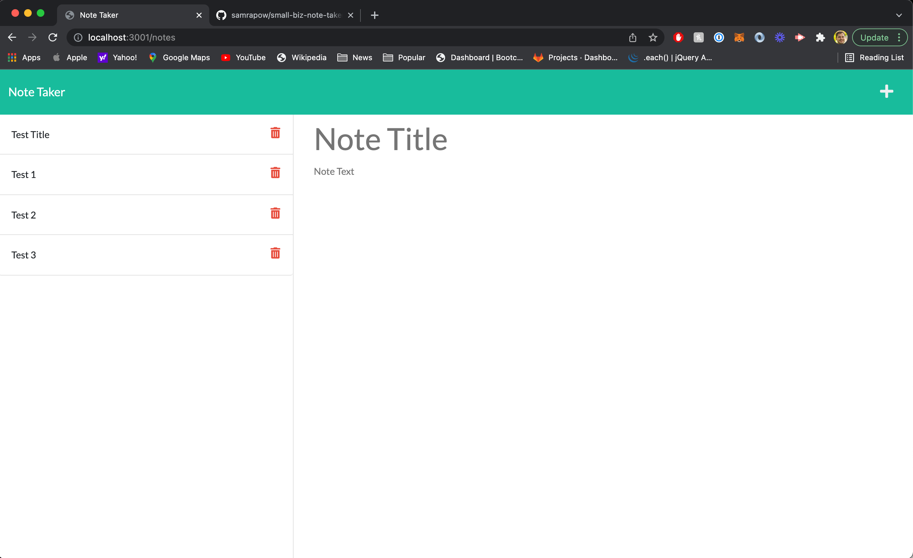

# Homework 11 - Note Taker

## Description

I created a note taker application. When I click on the landing page to a link to the notes page, I get to a note generator.  When I enter a new note title and the note's text and click save, the note is saved and appears on the left side of the screen.  When I click on an existing note on the screen, the note expands on the right column. When I click to delete a note, it gets deleted.

## Heroku Deployed Application

[Heroku Deployed Application](https://small-biz-note-taker.herokuapp.com/notes)

## Screenshot

## GitHub Repository

[Github Repository](https://github.com/samrapow/small-biz-note-taker)